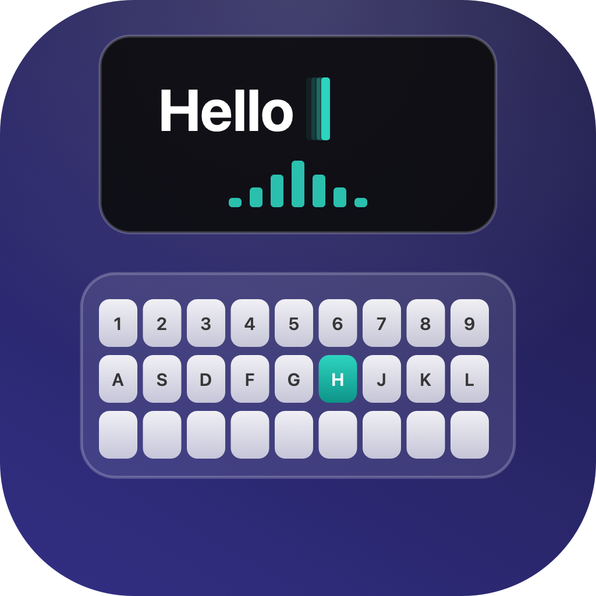
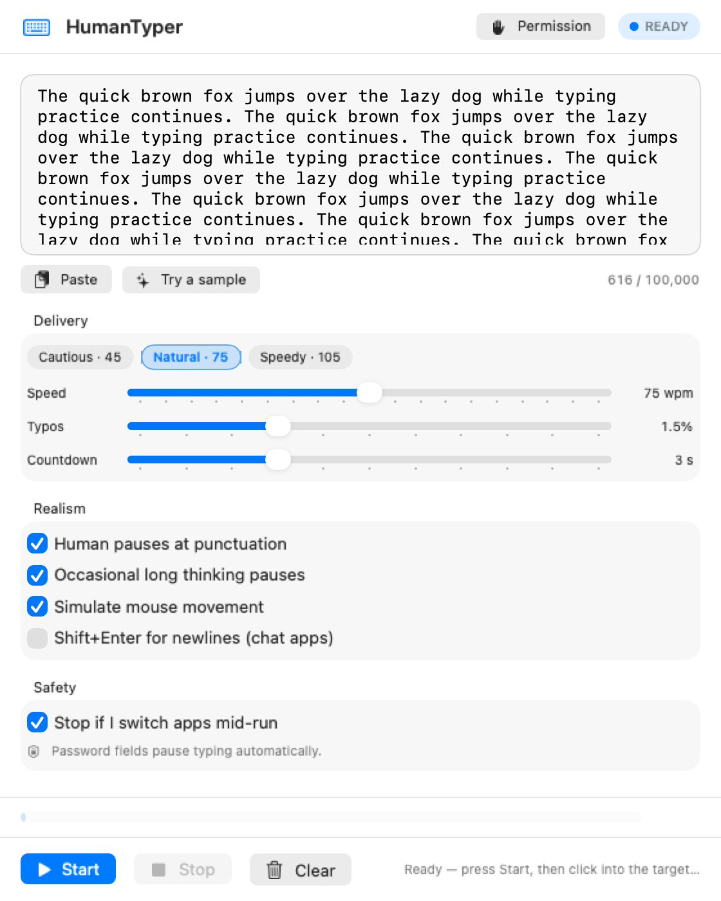
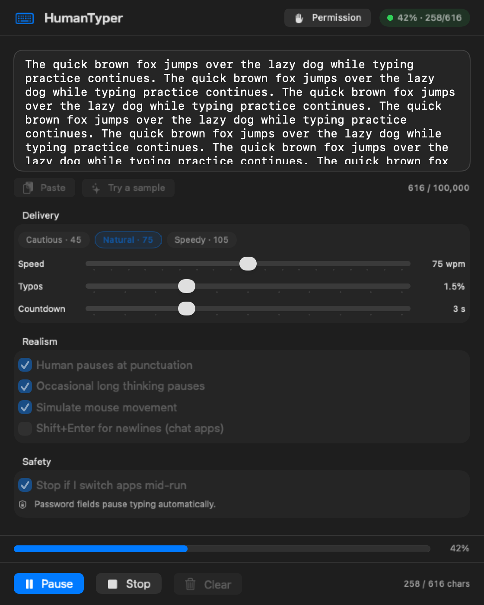
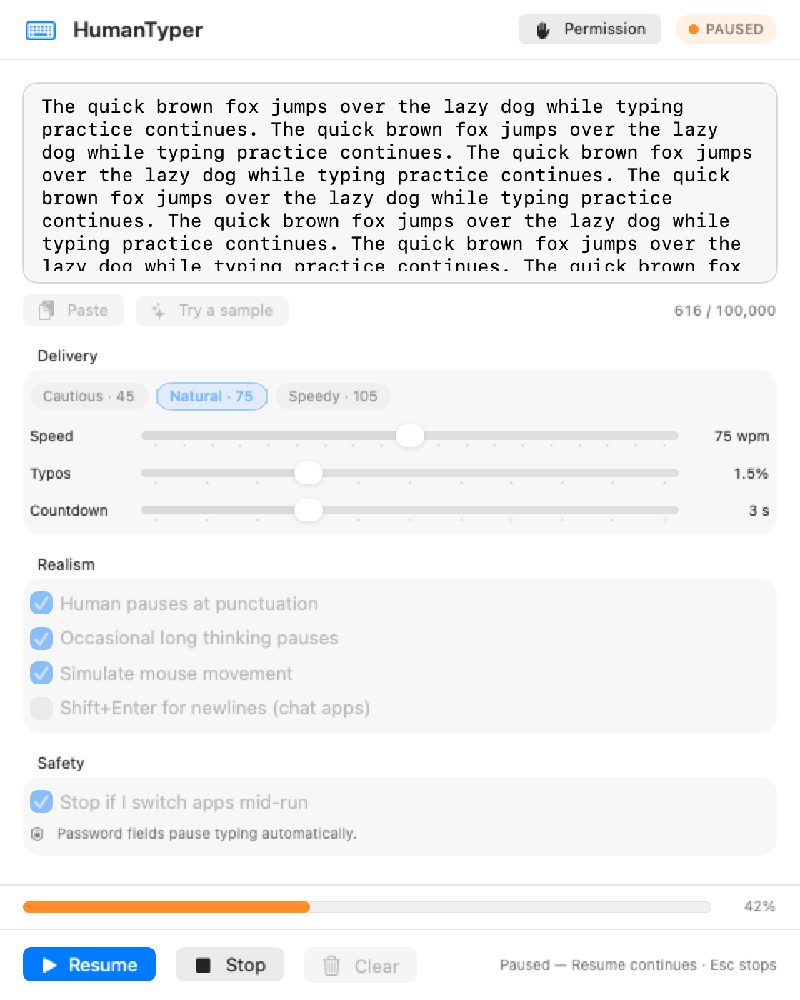
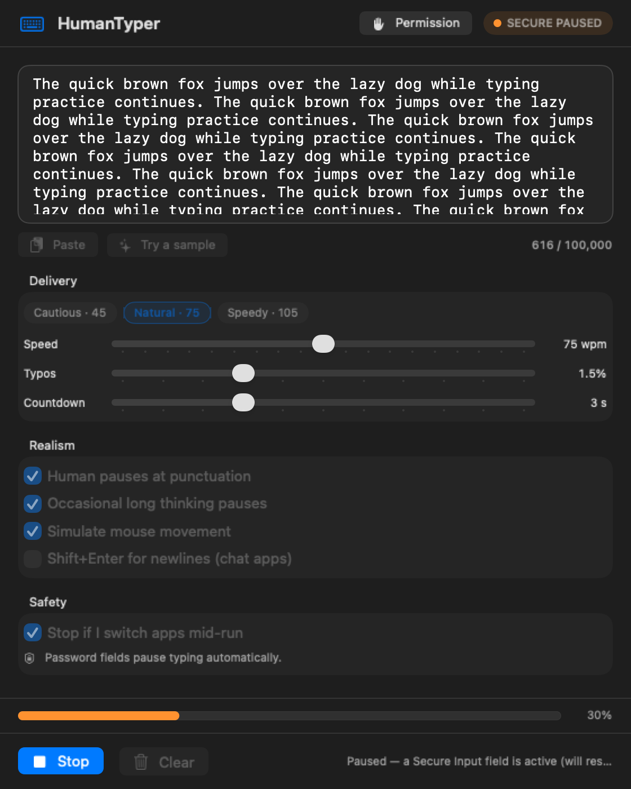
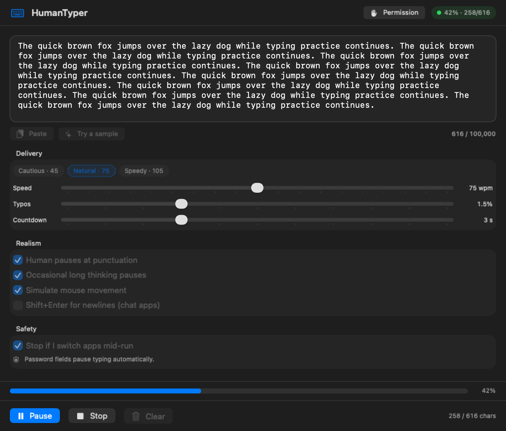
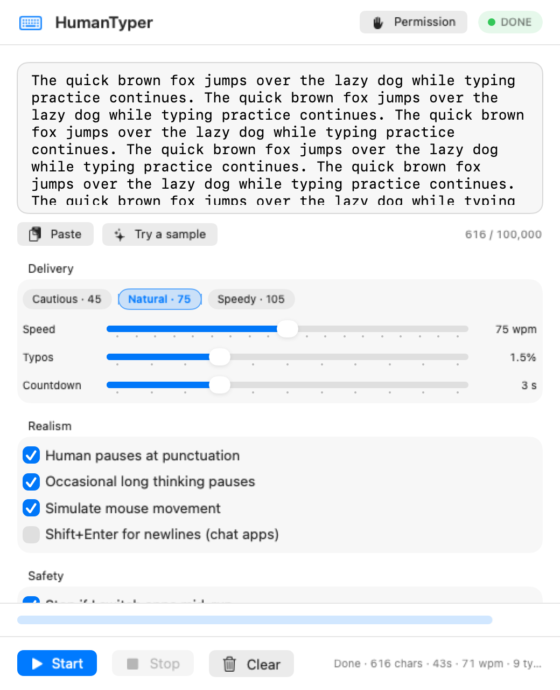
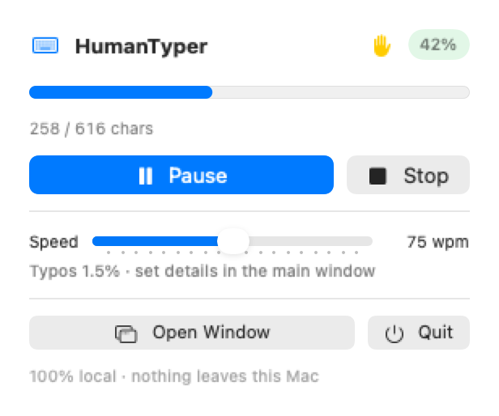
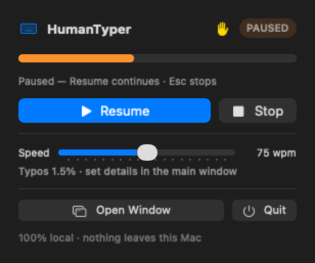

  

<h1 align="center">HumanTyper</h1>

  <b>A macOS app that types like a person.</b> 
  <a href="https://thehumantyper.com">Website</a> ·
  <a href="https://thehumantyper.com/#pricing">Pricing</a> ·
  <a href="https://thehumantyper.com/changelog">Changelog</a> ·
  <a href="https://thehumantyper.com/roadmap">Roadmap</a> ·
  <a href="https://thehumantyper.com/support">Support</a>

---

Paste text, put the cursor in any app, press Start. HumanTyper types the text
out with human timing: skewed inter-key intervals, word-start hesitation,
motor bursts, pauses around punctuation, typos that mostly get repaired, and
the occasional short glide of the mouse.

It posts real key events to the **HID event tap**, the same path a physical
keyboard uses, so the target app sees ordinary keyboard activity. Nothing is
pasted, nothing is injected through the accessibility API, and nothing is sent
to a clipboard. No network, no cloud, no telemetry. Everything runs on your Mac.

## This repository

**This is the product and design showcase. The application source is private.**

| Here | Not here |
|---|---|
| What the app does, and what it refuses to do | `Sources/` (the Swift implementation) |
| The module architecture and the event pipeline, in prose | The calibrated numbers of the timing model |
| The research the model is built on | The licence server and fulfilment code |
| Screenshots rendered from the real views | The vendor runbook and infrastructure |

Docs: [architecture](docs/architecture.md) · [research](docs/research.md) ·
[changelog](CHANGELOG.md) · [licence](LICENSE)

## Screenshots

Rendered offscreen from the real `ContentView` and `MenuPanelView` by the
project's own render harness, at 2x, in light and dark. Nothing here is a
mockup or a design file: these are the shipping views.

<table>
  <tr>
    <td width="50%"></td>
    <td width="50%"></td>
  </tr>
  <tr>
    <td align="center">Ready: editor, presets, settings. Nothing overlaps the text.</td>
    <td align="center">Typing: phase capsule, progress, transport bar.</td>
  </tr>
  <tr>
    <td width="50%"></td>
    <td width="50%"></td>
  </tr>
  <tr>
    <td align="center">Paused by the user: the strip turns orange, Resume is the prominent action.</td>
    <td align="center">Auto-paused on a Secure Input field, with the reason shown.</td>
  </tr>
  <tr>
    <td width="50%"></td>
    <td width="50%"></td>
  </tr>
  <tr>
    <td align="center">Wide layout: the same views, no clipping.</td>
    <td align="center">Minimum window size, finished run, compact summary.</td>
  </tr>
  <tr>
    <td width="50%"></td>
    <td width="50%"></td>
  </tr>
  <tr>
    <td align="center">Menu bar mission control, mid-run.</td>
    <td align="center">The same panel while paused.</td>
  </tr>
</table>

## What it does

**Realism that survives a stopwatch**

- **Honest speed dial.** The slider from 30 to 120 words per minute means what
  it says. Before a run the engine measures its own pipeline offline and solves
  for the scale that hits the setting, so delivered speed lands within about 2
  percent of the target, at every setting on the dial.
- **Human rhythm, not a timer.** Inter-key intervals are drawn from the skewed
  distributions real typing produces, with short motor bursts and the pauses
  between them, function words typed faster than their letters suggest, and
  digraph transitions that run slow or fast depending on which fingers are
  involved.
- **Word-level cognition.** The first keystroke of a word waits on lexical
  access while the rest of the word overlaps with motor preparation, which is
  why real words start slow and finish fast. Long words cost more, and a
  session settles in over its first stretch.
- **Punctuation and thought.** Pauses after sentence ends are probabilistic:
  most are a breath, some are real thinking time, and a few roll straight on.
  A long text with no long pauses is a machine signature, so there are long
  pauses too, mostly after sentence ends.

**Mistakes, and what happens next**

- **The real error taxonomy:** near-miss substitutions dominate, omissions
  (a dropped key that never reaches the screen) are second, plus reversals,
  double-strikes and perseverations.
- **Near misses come from finger anatomy,** not from uniform random choice:
  slips land on touching keys most often and on wild fat-fingers rarely, biased
  by which finger and which hand was involved.
- **Layout aware.** The active keyboard layout is captured at run start, so
  slips (and typing itself) match your real QWERTZ, AZERTY, Dvorak or Cyrillic
  layout instead of a hard-coded QWERTY.
- **Correction behaviour:** most slips are caught within a keystroke or two,
  some are only noticed after the word and repaired retrospectively with a
  backspace drum or a whole-word delete, and some are never noticed at all.
  Errors cluster for a few words after a slip, the keystrokes right after a
  mistake run slower, faster speed settings make more mistakes, and each run
  draws its own clumsiness.
- **Two human tells, both optional:** capitals that land lowercase (a missed
  Shift, later caught or missed) and a finished word that comes out twice.

**Hardware, not text injection**

- **Discrete Shift key events.** Capitals and symbols come from modifier
  choreography: Shift goes down before the letter and comes up after, usually
  from the opposite hand as touch typists do, with a share of human violations.
- **Key holds, not just key flights.** Every key is held for a realistic dwell
  time, and hold time scales with the speed setting, because the whole motor
  pipeline is calibrated together.
- **Mouse movement,** sometimes and only sometimes: a short glide to a nearby
  point with Fitts-law duration, a velocity profile that peaks early, a
  slightly curved path, movements that land short and correct themselves, and
  endpoint scatter. Never a ruler-straight line, never an exact centre hit.

**Safety rails**

- **Stops if you switch apps mid-run** instead of pouring text into the wrong
  window, and re-checks the focused app after the countdown.
- **Secure Input awareness:** when a password field or a `sudo` prompt takes
  Secure Event Input, typing pauses itself and resumes after.
- **App Nap suppression,** so a long session never stalls on a throttled timer.
- **Input hygiene:** control characters stripped, a hard character cap,
  unicode chunked at scalar boundaries so emoji with modifiers survive.
- Settings are snapshotted at Start, so nothing shifts under a running job.

## How it works

The app is a single Swift module split into a platform-neutral core and a thin
macOS shell. The core owns the model and the run loop; the shell owns the
window, the menu bar extra, the event tap and the settings store.

| Module | Responsibility |
|---|---|
| `Keymap` | Character to virtual keycode, both shift states, plus Shift side choice |
| `TimingModel` | The timing model, the speed calibration and the session state |
| `TypoModel` | Error taxonomy, layout-derived near misses, correction plans |
| `MouseGlide` | Pointer movement as a path with a duration profile |
| `EventPosting` | A protocol, so the engine can run against a recording sink in tests |
| `TypingEngine` | The run loop, guards, pause and resume |
| `EngineModel` | Observable run state shared by the window and the menu bar panel |
| `SelfTest` / `StatsReport` | The offline invariant suite and the realism audit |

Because the model sits behind `EventPosting`, the entire pipeline can be
replayed offline: the test suite re-interprets the raw event stream back into
text and asserts that it equals both the input and the engine's own screen
buffer, which is how desyncs between what the engine thinks it typed and what
actually left the process are caught before shipping.

More: [docs/architecture.md](docs/architecture.md).

## How it is verified

- **More than 120 offline invariant checks** covering the keymap, the timing
  distributions, the calibration, the error taxonomy and every correction plan,
  plus full end-to-end replays. They post no events and need no permissions.
- **An offline realism audit** that prints delivered words per minute across
  the dial, the shape of the inter-key distribution, pause structure and
  correction density, so the honest-speed claim is checkable rather than
  asserted.
- **A calibration sweep** over every integer setting from 20 to 130 that
  reports the worst delivered-versus-requested error.
- **A render harness** that draws the real views offscreen into PNGs at 8
  states, 3 window sizes, light and dark (58 images), so a layout regression is
  caught visually without launching the app or granting Accessibility.
- **Windows CI** that compiles the shared core and runs the same behavioural
  suite on a Windows runner, ahead of a Windows release.

## Pricing, licensing and privacy

- **Free forever** for runs up to 500 characters, with the core human rhythm
  and clean, typo-free output. Not a trial: no clock, no email wall.
- **Pro is a one-time purchase,** no subscription. It removes the length cap and
  unlocks realistic typos with corrections, long thinking pauses, simulated
  mouse movement, and the two slips above (missed-Shift capitals and doubled
  words).
- **One licence, one device.** A Pro licence is paired to a single machine at
  activation. Moving to a new Mac is expected: deactivate, then request a fresh
  activation.
- **Activation is 100 percent offline.** Licence keys are Ed25519-signed and
  verified locally, so activation never touches the network, which is the whole
  point of a tool whose promise is that nothing leaves the Mac.
- The app never connects to anything, and there is no analytics.

## Responsible use

HumanTyper is a convenience and accessibility tool. It is not for
misrepresenting human work where that violates another party's terms: academic
submissions, contests, salaried work product, or services that forbid
automation. It is not a way around proctoring or integrity systems, and the
author will not help with that. You are responsible for what you type with it.

## Credits

Built by Yancheng "Ethan" Dai. Every behavioural parameter in the timing model
traces to published research, cited in full in
[docs/research.md](docs/research.md).

Not affiliated with Apple Inc.

© 2026 HumanTyper. All rights reserved. See [LICENSE](LICENSE).
